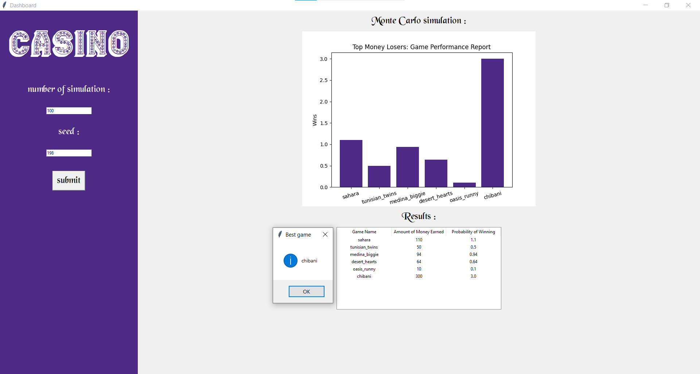

## Features
- Simulates thousands of iterations for each card game.
- Analyzes potential outcomes and profitability.
- Built with a user-friendly interface using **Tkinter**.

## How it Works
1. **Monte Carlo Simulation**: The app simulates various game scenarios, calculating the expected returns for each card game.
2. **Data Visualization**: Matplotlib is used to visualize the simulation results, providing insights into which games offer the best profitability.
3. **User Interface**: The interface, developed using Tkinter, allows users to easily interact with the application and view the results.

## Installation
To run the Casino Profit Optimizer, make sure you have Python installed. Then, clone the repository and install the necessary dependencies:
